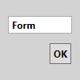

# Form
Form is a GUI form editor for Microsoft Small Basic programming language. 

Version 0.51b
- #7 refactored according to SBDoc comment spec.
- This version is just displays form written in a form file.

## Download
[Form0_51b.zip](Form0_51b.zip)

## Usage
- Download zip file above.
- Unzip the zip file from Explorer.
- Run Form.exe from Explorer.
